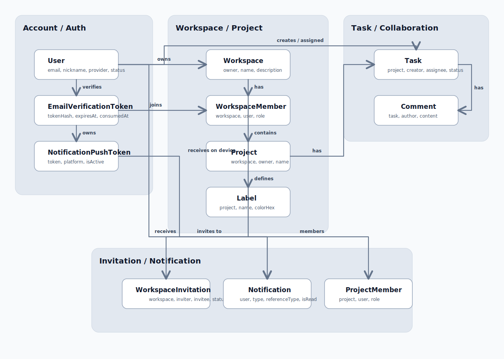

# EasyWork

EasyWork는 팀 협업을 위한 작업 관리 웹 애플리케이션입니다.  
작업공간, 프로젝트, 작업, 초대, 알림, 계정 관리를 하나의 흐름으로 연결해 로컬 환경에서 바로 실행하고 검증할 수 있도록 구성했습니다.

## 핵심 기능

### 인증 / 계정
- 이메일·비밀번호 회원가입 / 로그인
- Google / Naver OAuth 로그인
- 이메일 인증 링크 검증 및 재발송
- 비밀번호 변경
- 회원 탈퇴

### 협업
- 작업공간 생성 / 조회 / 상세 화면
- 프로젝트 생성 / 목록 / 보드 / 작업 목록
- 프로젝트 멤버 관리 및 초대
- 작업 상태 변경
- 라벨 관리
- 댓글 및 첨부파일 처리

### 알림
- 앱 내 알림 목록
- 작업공간 초대 알림 연동
- 웹 푸시 토큰 등록 / 해제
- 브라우저 환경 진단 기반 웹 푸시 등록 UX

### 탐색 / UX
- 대시보드 프로젝트 현황
- 최근 프로젝트 사이드바
- 프로젝트 / 작업공간 전역 검색

## 주요 유스케이스

1. 로컬 계정 사용자 회원가입
- 사용자는 이메일, 닉네임, 비밀번호로 회원가입합니다.
- 이메일 인증이 활성화된 환경에서는 인증 메일을 확인한 뒤 로그인할 수 있습니다.

2. 소셜 로그인 사용자 진입
- 사용자는 Google 또는 Naver 로그인 버튼으로 인증을 시작합니다.
- OAuth callback 처리 후 세션이 발급되면 대시보드로 이동합니다.

3. 작업공간 생성과 협업 시작
- 사용자는 작업공간을 만들고 설명을 입력할 수 있습니다.
- 작업공간 상세 화면에서 프로젝트를 만들고 초대 흐름을 시작할 수 있습니다.

4. 프로젝트 운영
- 사용자는 작업공간 안에서 프로젝트를 생성합니다.
- 프로젝트 보드, 작업 목록, 멤버 관리, 라벨 설정 화면으로 이동할 수 있습니다.

5. 작업 관리
- 사용자는 작업을 생성하고 담당자, 우선순위, 마감일, 설명을 관리합니다.
- 작업은 상태 이동, 댓글 작성, 첨부파일 처리 흐름과 연결됩니다.

6. 알림 및 디바이스 등록
- 사용자는 알림 목록에서 초대와 상태 변화를 확인합니다.
- 계정 설정 화면에서 브라우저 웹 푸시 토큰을 등록하거나 해제할 수 있습니다.

## 기술 스택

### Frontend
- React 18
- TypeScript
- Vite
- React Router
- Zustand
- TanStack Query
- Tailwind CSS
- Firebase Cloud Messaging SDK
- Vitest / Testing Library

### Backend
- Java 21
- Spring Boot 3.2
- Spring Security
- Spring Data JPA
- Spring Data Redis
- Spring WebSocket
- Spring Mail
- QueryDSL
- MySQL
- Redis
- JUnit 5

## 디렉터리 구조

```text
backend/   Spring Boot API
frontend/  React + Vite UI
docs/      문서 및 계획 파일
```

## 간단 ERD

아래 다이어그램은 README 가독성을 위해 핵심 협업 흐름만 남긴 요약본입니다.  
첨부파일 정리 작업, retry job, 상태 이력, 일부 직접 관계는 의도적으로 생략했습니다.



- README에는 가독성을 위해 핵심 관계만 요약한 도식만 유지합니다.
- 상세 설계가 더 필요해지면 `docs/` 아래에 도메인별 ERD를 분리하는 편이 좋습니다.

## 로컬 실행

### 1. 사전 준비

- Java 21
- Node.js 20+
- npm
- Docker Desktop

### 2. 환경변수 파일 준비

루트 디렉터리에서 `.env.example`을 기준으로 `.env`를 준비합니다.

```powershell
Copy-Item .env.example .env
```

주의:
- 실제 secret 값은 `.env`에만 넣고 Git에 커밋하지 않습니다.
- frontend는 `frontend/.env`가 아니라 루트 `.env`를 읽습니다.
- `DB_URL`의 database 이름은 `MYSQL_DATABASE`와 맞춰 사용하는 편이 안전합니다.

### 3. MySQL / Redis 실행

```powershell
docker compose up -d mysql redis
```

### 4. Backend 실행

```powershell
cd backend
.\gradlew.bat bootRun
```

기본 주소:
- `http://localhost:8080/api/v1`

Health check:

```powershell
Invoke-WebRequest http://localhost:8080/api/v1/actuator/health
```

### 5. Frontend 실행

```powershell
cd frontend
npm install
npm run dev
```

기본 주소:
- `http://localhost:5173`

## 환경변수 정리

### 필수

| 변수명 | 설명 |
|---|---|
| `DB_URL` | MySQL JDBC URL |
| `DB_USERNAME` | MySQL 사용자명 |
| `DB_PASSWORD` | MySQL 비밀번호 |
| `JWT_SECRET` | JWT 서명 키 |
| `REDIS_HOST` | Redis 호스트 |
| `REDIS_PORT` | Redis 포트 |
| `REDIS_PASSWORD` | Redis 비밀번호(없으면 빈 값) |

### OAuth

| 변수명 | 설명 |
|---|---|
| `OAUTH_GOOGLE_CLIENT_ID` | Google OAuth Client ID |
| `OAUTH_GOOGLE_CLIENT_SECRET` | Google OAuth Client Secret |
| `OAUTH_GOOGLE_REDIRECT_URI` | Google callback URL |
| `OAUTH_NAVER_CLIENT_ID` | Naver OAuth Client ID |
| `OAUTH_NAVER_CLIENT_SECRET` | Naver OAuth Client Secret |
| `OAUTH_NAVER_REDIRECT_URI` | Naver callback URL |

현재 로컬 검증 기준 callback URL:
- `http://localhost:5173/oauth/google/callback`
- `http://localhost:5173/oauth/naver/callback`

### 이메일 인증

| 변수명 | 설명 |
|---|---|
| `APP_EMAIL_VERIFICATION_ENABLED` | 이메일 인증 기능 사용 여부 |
| `APP_EMAIL_VERIFICATION_FROM` | 발신자 이메일 |
| `APP_EMAIL_VERIFICATION_VERIFY_BASE_URL` | 인증 완료 프론트 경로 |
| `MAIL_HOST` | SMTP 호스트 |
| `MAIL_PORT` | SMTP 포트 |
| `MAIL_USERNAME` | SMTP 계정 |
| `MAIL_PASSWORD` | SMTP 비밀번호 또는 앱 비밀번호 |

### 웹 푸시 / Firebase

| 변수명 | 설명 |
|---|---|
| `VITE_FIREBASE_API_KEY` | Firebase Web API Key |
| `VITE_FIREBASE_AUTH_DOMAIN` | Firebase Auth Domain |
| `VITE_FIREBASE_PROJECT_ID` | Firebase Project ID |
| `VITE_FIREBASE_MESSAGING_SENDER_ID` | Firebase Messaging Sender ID |
| `VITE_FIREBASE_APP_ID` | Firebase App ID |
| `VITE_FIREBASE_VAPID_KEY` | Web Push VAPID Public Key |
| `FCM_SERVER_KEY` | Backend FCM 발송용 키 |

## 테스트 / 검증

### Frontend

```powershell
cd frontend
npm run test
npm run lint
npm run build
```

### Backend

```powershell
cd backend
.\gradlew.bat test --console=plain
```

## 현재 검증 상태

- Google / Naver OAuth 로컬 로그인 흐름 확인
- 웹 푸시 토큰 발급 및 서버 등록 확인
- 전역 검색, 최근 프로젝트, 로그인 후 이동 경로 UI 확인
- 이메일 인증의 실제 SMTP 발송은 아직 미검증
- 웹 푸시의 실제 발송 / 수신은 아직 미검증

## 보안 주의사항

- `.env`, 서비스 계정 JSON, OAuth client secret, `JWT_SECRET`, `MAIL_PASSWORD`, `FCM_SERVER_KEY`는 저장소에 커밋하지 않습니다.
- `VITE_FIREBASE_*` 값은 frontend 런타임에서 사용되는 공개 설정이지만, secret 값과 혼동하지 않도록 분리해서 관리합니다.
- 배포 환경으로 전환할 경우 OAuth callback URL과 CORS 허용 origin을 운영 도메인 기준으로 다시 설정해야 합니다.
